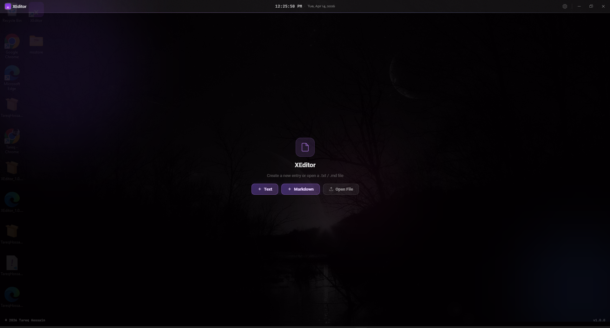
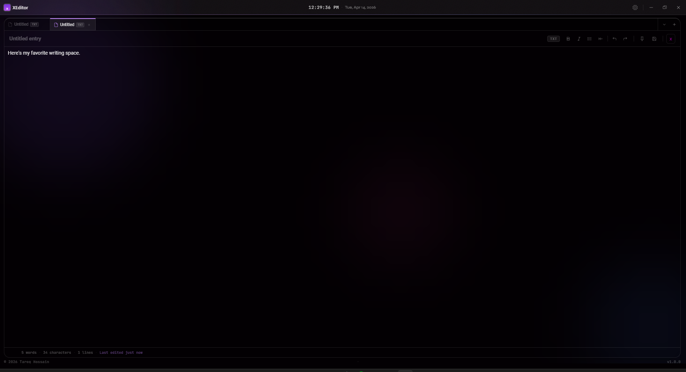

# XEditor

> A fast, lightweight, and modern text editor built with Rust and Tauri.



---

## Screenshots

| Text Editor View | Markdown Editor View|
|:-----------:|:-------------------:|
|  |  |


---

## Features

- ⚡ **Blazing Fast** — Native Rust performance, instant startup
- 🎨 **Syntax Highlighting** — Support for popular languages
- 🪶 **Lightweight** — Low memory footprint, no Electron bloat
- 🧹 **Clean UI** — Distraction-free, minimal interface
- 📂 **File Management** — Open, edit, and save files from anywhere
- 🔌 **Offline First** — No internet, no account required
- 🖥️ **Native Windows** — Built with Tauri + WebView2

---

## Download

### Windows

| Platform | Download |
|----------|----------|
| Windows x64 (MSI) | [XEditor_1.0.0_x64_en-US.msi](https://github.com/xtareq/xeditor/releases/download/v1.0.0/XEditor_1.0.0_x64_en-US.msi) |
| Microsoft Store | *Coming Soon* |

---

## Installation

### Option 1 — MSI Installer (Recommended)

1. Download the `.msi` file from [Releases](https://github.com/xtareq/xeditor/releases)
2. Double-click to run the installer
3. Follow the setup wizard
4. Launch **XEditor** from the Start Menu

### Option 2 — Microsoft Store

Search for **XEditor** on the Microsoft Store *(coming soon)*.

---

## Build from Source

### Prerequisites

- [Node.js](https://nodejs.org/) v18+
- [Rust](https://rustup.rs/) (latest stable)
- [Tauri CLI](https://tauri.app/v1/guides/getting-started/prerequisites)

### Steps

```bash
# Clone the repository
git clone https://github.com/xtareq/xeditor.git
cd xeditor

# Install dependencies
npm install

# Run in development mode
npm run tauri dev

# Build for production
npm run tauri build
```

The built installer will be at:
```
src-tauri/target/release/bundle/msi/XEditor_x.x.x_x64_en-US.msi
```

---

## Tech Stack

| Layer | Technology |
|-------|-----------|
| Frontend | HTML / CSS / JavaScript |
| Backend | Rust |
| Desktop Framework | Tauri |
| Windows Runtime | WebView2 |
| Installer | MSI / MSIX |

---

## System Requirements

| | Minimum | Recommended |
|---|---------|-------------|
| OS | Windows 10 64-bit (1903+) | Windows 11 64-bit |
| RAM | 4 GB | 8 GB |
| Storage | 100 MB | SSD preferred |
| Runtime | WebView2 (auto-installed) | WebView2 (auto-installed) |

---

## Contributing

Contributions are welcome! Here's how to get started:

1. Fork the repository
2. Create a new branch: `git checkout -b feature/your-feature`
3. Make your changes and commit: `git commit -m "Add your feature"`
4. Push to your branch: `git push origin feature/your-feature`
5. Open a Pull Request

Please open an [issue](https://github.com/xtareq/xeditor/issues) first for major changes.

---

## Roadmap

- [ ] Multi-tab editing
- [ ] Theme support (Mutilcolor)
- [ ] Extension/plugin system
- [ ] Auto-update support

---

## License

This project is licensed under the **MIT License** — see the [LICENSE](LICENSE) file for details.

```
MIT License
Copyright (c) 2024 Tareq Hossain
Permission is hereby granted, free of charge, to any person obtaining a copy
of this software to use, copy, modify, merge, publish, and distribute it freely.
```

---

## Author

**Tareq Hossain**
- GitHub: [@xtareq](https://github.com/xtareq)

